# Venue Studio

> Turn a photograph of an empty venue into a validated, editable event plan by talking to your own agent.

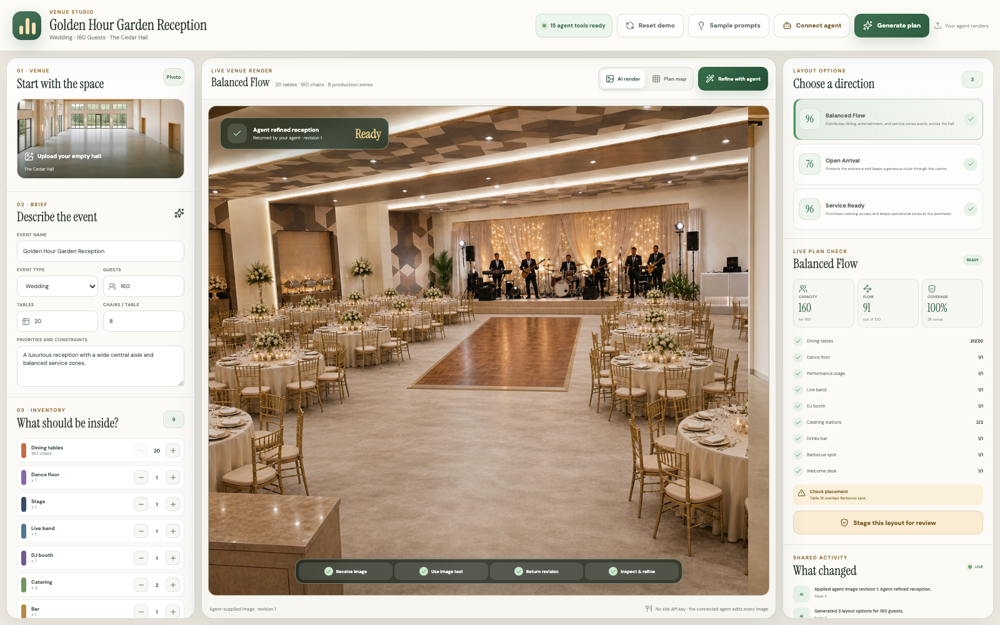

Venue Studio is a photo-backed event layout workspace built for the WebMCP Challenge. A planner uploads an empty hall, states the guest count and requirements, and asks their connected agent to arrange it. The agent receives the real project state and source image through WebMCP, creates a photoreal revision with its own image capability, returns it to the browser, inspects the result, and keeps refining it with the human.

There is no sign-in wall, no site-owned image model, and no API key to configure. The agent the user already chose supplies the intelligence. The browser supplies the domain tools, shared state, validation, and human approval boundary.

## The 15-second judge story

Most agents can describe an event layout. Venue Studio lets one operate the layout application itself.

1. Start with a real empty-hall photograph.
2. Say: “Plan this wedding for 160 guests with 20 eight-seat tables, a dance floor, band, DJ, catering, bar, and barbecue.”
3. Watch the brief, inventory, three layout strategies, and validation update in the shared UI.
4. Let the agent receive the image, render a coherent venue photograph, return it, inspect it, and refine it.
5. Switch to Plan Map and move, resize, or rotate the same objects manually or through the agent.
6. Let the agent stage its recommendation; only the human can approve and export.

## Why WebMCP changes the product

Without WebMCP, an agent must infer state from pixels, click approximate coordinates, and guess whether the result is valid. Venue Studio exposes the application’s actual concepts: venue image, event brief, inventory, layout strategies, object transforms, validation, render revisions, staging, and review state.

Human and agent actions call the same store and planning engine. Every mutation appears immediately in the interface and in one shared activity trail.

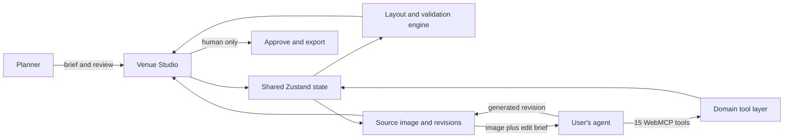

## Signature agent workflow

Copy this into any image-capable agent connected to the open page:

> Use `venue.load_image` with my empty hall photograph, then plan it for 160 guests with exactly 20 tables and 8 chairs per table, a dance floor, live band, DJ, two catering stations, a drinks bar, and an outdoor barbecue. Generate the strongest layout. Call `venue.render_scene` to receive the current image and exact edit brief. Use your own image tool to create the photoreal revision, then return it with `venue.apply_image_revision`. Capture and inspect the returned image. For each improvement, call `venue.refine_scene`, edit the returned image with your own image tool, and apply the new revision. Continue until the spacing and realism are excellent, validate the layout, and stage it for my review.

The image loop is deliberately agent-owned:

`receive image → render with the agent's image tool → return revision → inspect → refine`

## Ten events, with the prompt behind every result

The repository carries the whole visual story. Each finished scene below includes the prompt an image-capable agent can use while operating Venue Studio through WebMCP.

### Emerald Nigerian Wedding

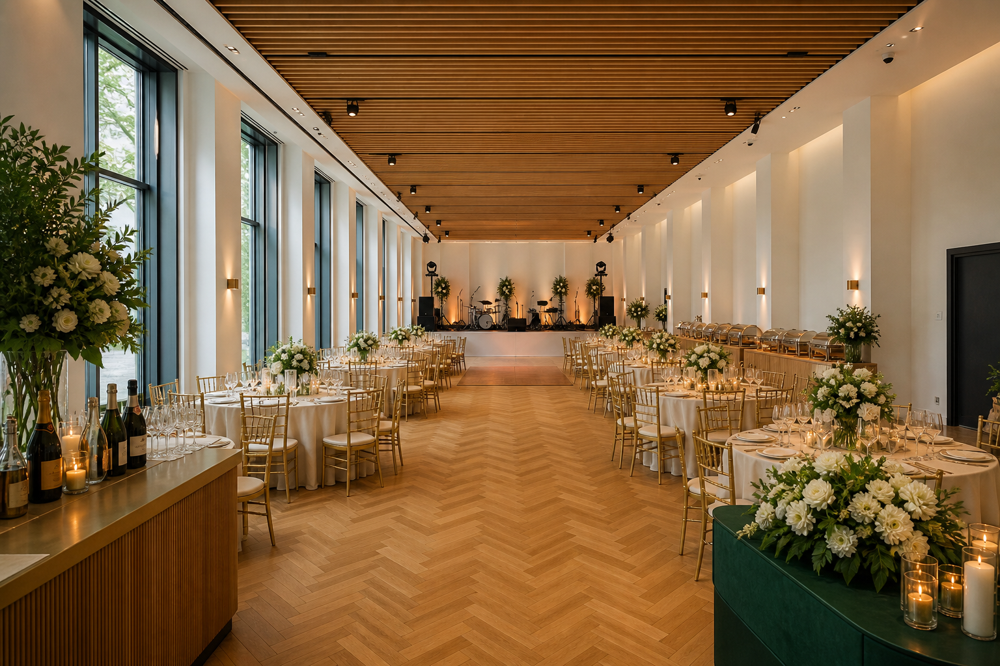

**Agent prompt**

> Transform this empty hall into an elegant Nigerian wedding reception for 120 guests. Use exactly 12 round dining tables with 10 champagne-gold chairs per table, ivory linen, low white-and-emerald floral centrepieces, a generous central aisle, a wood dance floor, an elevated live-band stage, a compact DJ booth, two buffet stations, a drinks bar, a welcome desk and a refined photo area. Keep food service away from the entrance and preserve every wall, window, door, column, ceiling feature, floor material and the original camera viewpoint. Render one coherent, ultra-photorealistic venue photograph with physically plausible scale, perspective, reflections and contact shadows. No people, labels, logos or floating furniture. Capture the result, inspect the spacing and realism, refine any weak area, validate the plan and stage the best version for my review.

### Future Product Launch

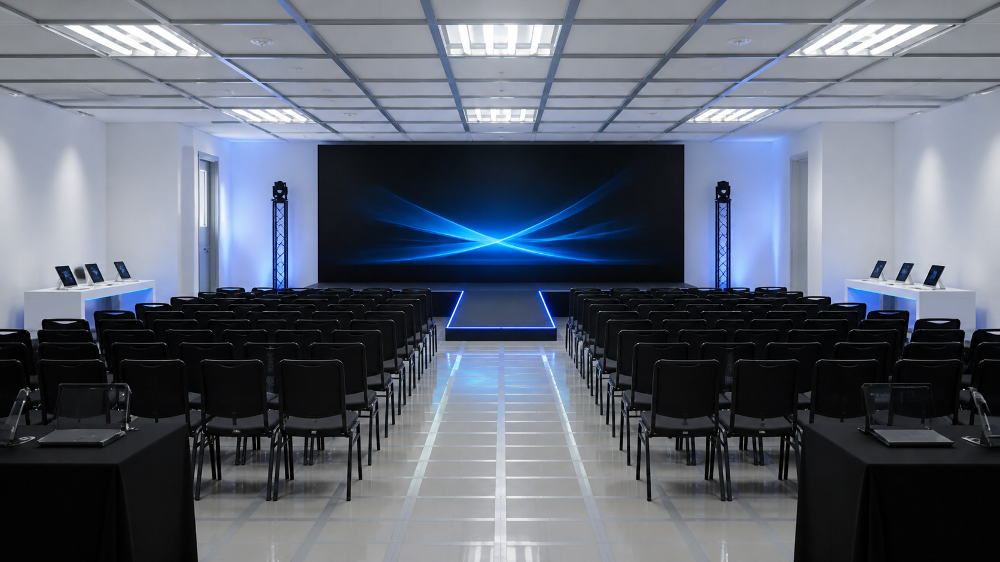

**Agent prompt**

> Turn this empty venue into a premium technology product launch for 140 guests. Create disciplined theatre seating with a wide accessible centre aisle, a low black presentation stage against the far wall, a large seamless LED screen, a short illuminated product runway, two symmetrical demo islands, a registration desk near the entrance, a coffee station, discreet power distribution and a small media zone. Use matte white, graphite and controlled electric-blue light accents while preserving the exact room geometry, doors, ceiling grid, flooring and camera perspective. Produce a realistic architectural-event photograph with crisp commercial lighting, accurate shadows and no people, branding, text or fantasy architecture. Use your own image tool, return every revision through WebMCP, capture and inspect it, then refine until the launch feels buildable and premium.

### Black-Tie Awards Night

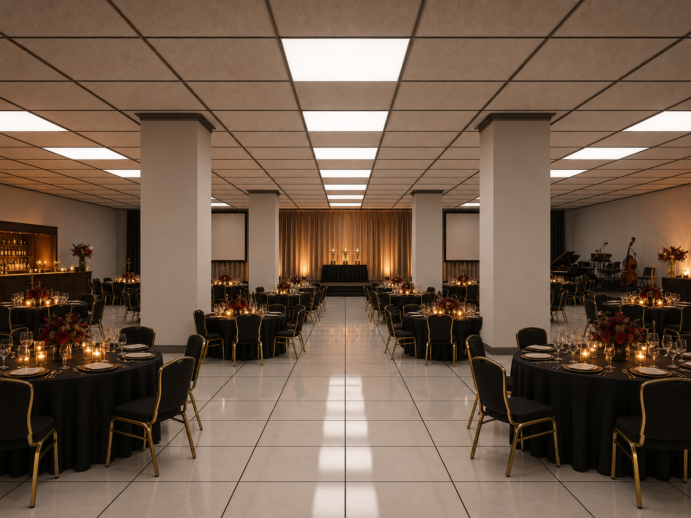

**Agent prompt**

> Design this columned hall as a black-tie awards dinner for 160 guests. Arrange exactly 20 round tables with 8 chairs each in balanced groups around the existing columns, protecting clear sightlines and two continuous exit routes. Add an elegant stage and projection wall at the far end, a central winner's aisle, a trophy display, a compact live-band area, two service stations, a dark timber cocktail bar and subtle lounge seating near the perimeter. Use black, warm ivory, brushed brass and deep burgundy with cinematic amber lighting. Preserve every column, wall, ceiling tile, floor grid and the original camera position. The final result must be one convincing high-end event photograph with realistic materials and contact shadows, no people, text, logos or structural changes. Capture and visually inspect the render, refine any collision or awkward sightline, validate and stage it.

### Luxury Fashion Runway

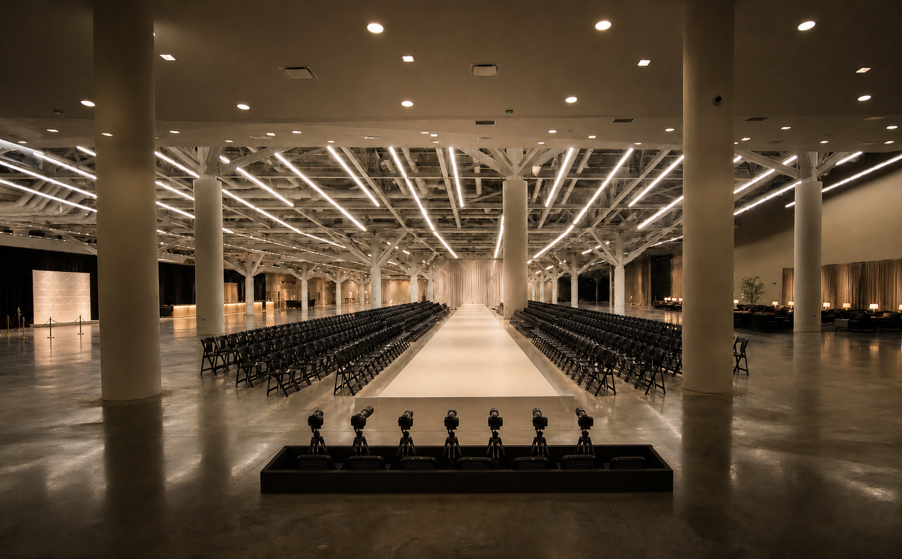

**Agent prompt**

> Plan this hall as a luxury fashion show for 220 guests. Build one long raised runway on the strongest visual axis, two exact banks of guest seating, a photographers' pit, backstage screening, check-in, coat check, a sponsor-photo wall and a compact post-show cocktail lounge. Keep a clear fire route around both sides and protect every door. Use warm white architectural light, a matte ivory runway, black seating and restrained chrome accents. Preserve the room and camera exactly. Create a photoreal editorial event photograph, then capture, inspect and refine the layout before validation and staging.

### Afrobeats Birthday Concert

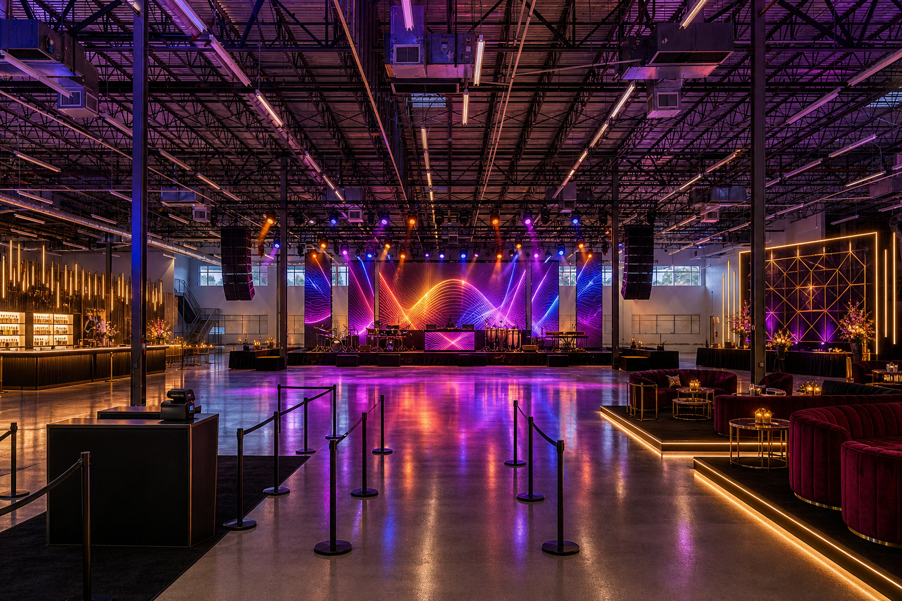

**Agent prompt**

> Convert this venue into an immersive Afrobeats birthday concert for 300 guests. Create a professional performance stage with live band and DJ, a large standing dance zone, two raised VIP lounges, two drinks bars, a dramatic photo wall, a welcome checkpoint, security lanes and clearly protected exits. Use rich amber, magenta and cobalt concert lighting with polished black production equipment and subtle gold celebration details. Preserve all architecture and render a plausible premium concert photograph with no crowd, text or logos. Capture the scene, inspect access and realism, refine it, validate the plan and stage the safest version.

### Leadership Summit

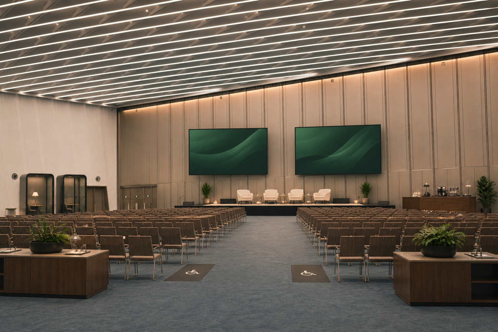

**Agent prompt**

> Arrange this empty venue for a 180-person leadership summit. Use theatre seating with an accessible central aisle, a presentation stage with twin screens, a moderated-panel setup, two acoustic breakout pods, four sponsor demo booths, registration, coffee service, a media desk and reliable perimeter power. Maintain clean circulation and unobstructed doors. Use warm neutral conference lighting, walnut, cream and muted forest green. Preserve the original building and camera view, render one realistic buildable conference photograph, capture it, inspect it, refine weaknesses, validate and stage the best plan.

### Art and Cocktail Evening

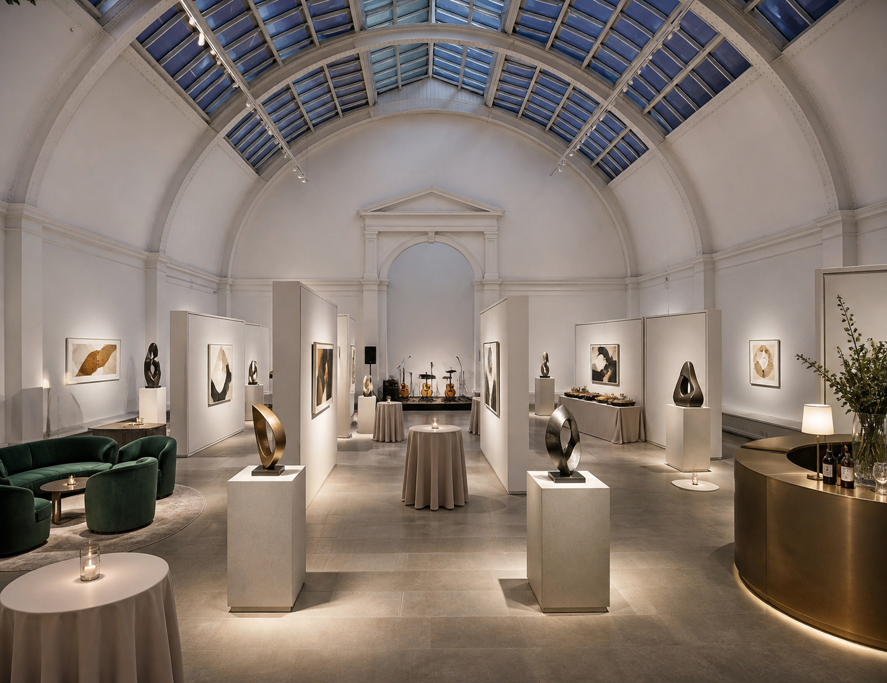

**Agent prompt**

> Transform this room into a contemporary art exhibition and cocktail evening for 130 guests. Place eight sculptural display plinths and six framed-art partitions with generous circulation, then add elegant standing cocktail tables, a small acoustic stage, a curved bar, a catering station, a collector lounge and a discreet welcome desk. Use gallery-white light with warm pools around the art, pale stone, brushed bronze and deep green upholstery. Keep every architectural feature unchanged. Produce a sophisticated photoreal gallery-event image, capture and inspect it, refine the flow and stage the validated result.

### Graduation Ceremony

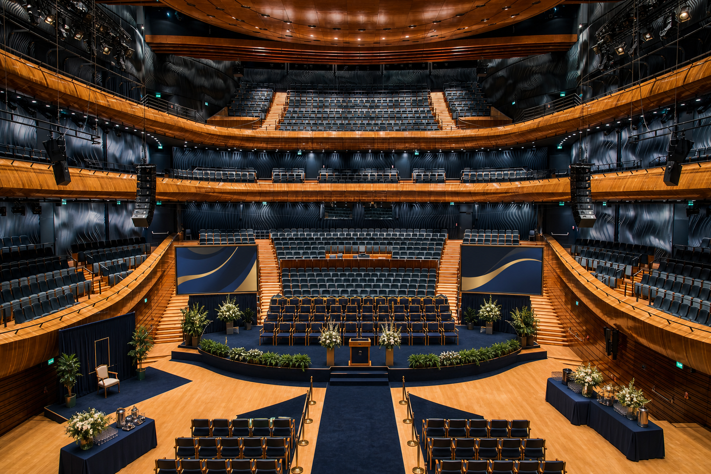

**Agent prompt**

> Prepare this hall for a graduation ceremony and family reception for 240 guests. Create a formal stage with lectern, graduate seating, balanced family-chair sections, one wide processional aisle, wheelchair spaces, a certificate-photo area, registration, two refreshment stations and clearly marked open exit routes. Use navy, cream and restrained gold with bright dignified lighting. Preserve the architecture and viewpoint. Render a realistic ceremony photograph without people or text, inspect the captured scene, refine any blocked view or route, validate and stage the final plan.

### Indoor Food Festival

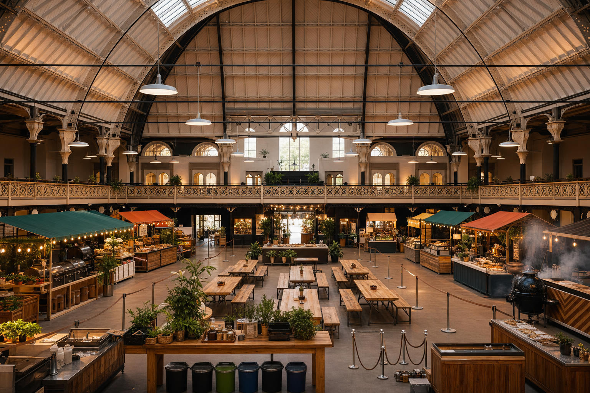

**Agent prompt**

> Turn this venue into an indoor food festival for 250 visitors. Arrange twelve distinct vendor stalls around the perimeter, shared communal tables in the centre, a chef-demonstration stage, two drinks points, hand-wash stations, waste points, a welcome desk and one barbecue zone positioned at a safe ventilated edge. Design visible queue lanes without blocking exits or seating. Use lively natural materials, warm market lighting and restrained colour. Preserve the hall exactly and create a photoreal operational event scene, then capture, inspect, refine, validate and stage it.

### Charity Dinner and Auction

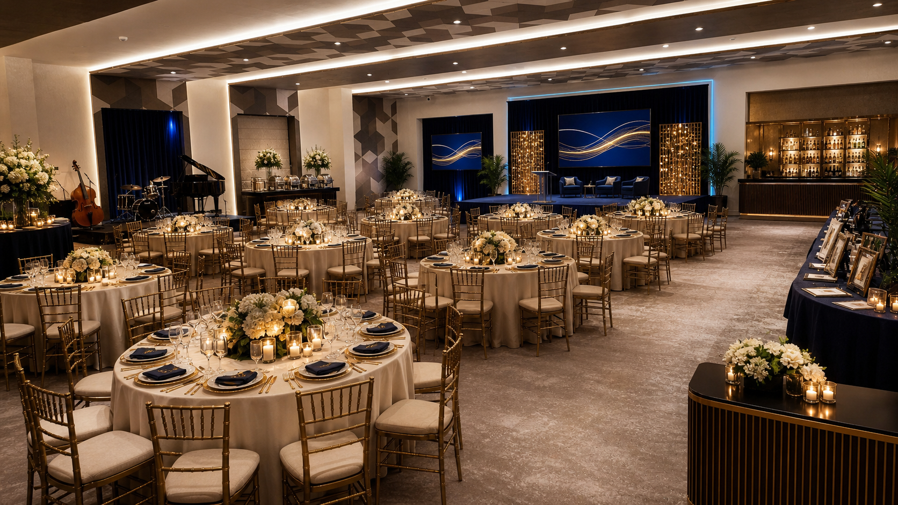

**Agent prompt**

> Design this venue for a 200-person charity dinner and live auction. Use exactly 20 round tables with 10 chairs each, a raised auction stage, two presentation screens, a central bidding aisle, a silent-auction display gallery, a live jazz-band corner, two catering stations, a refined bar, a donor welcome desk and a photography backdrop. Keep service circulation separate from guest arrival and preserve all exits. Use midnight blue, warm ivory, antique gold and candle-like lighting. Preserve the original architecture and camera. Render one luxurious realistic photograph, capture it, inspect the composition, refine any weak area, validate and stage the strongest result.

The full judge-facing story, including the empty-hall comparison and implementation narrative, is in [Project Story](docs/submission/PROJECT_STORY.md).

## What works today

- Upload or drag in a JPG, PNG, or WebP image of an empty venue.
- Configure wedding, concert, conference, corporate, birthday, festival, or custom events.
- Set exact guest, table, and chair counts without collecting attendee names.
- Add dining, dance floor, stage, band, DJ, catering, bar, barbecue, lounge, photo booth, welcome desk, power, restroom, and custom zones.
- Generate three visible strategies: Balanced Flow, Open Arrival, and Service Ready.
- Compare capacity, flow, coverage, and placement warnings.
- Render one table object per requested table with its exact chair capacity.
- Move objects by drag or structured coordinates.
- Scale, resize, flat-rotate, and change 3D orientation from the UI or an agent call.
- Toggle between an agent-produced photoreal scene and a precise editable Plan Map.
- Return the complete current image to the agent for visual inspection.
- Reject stale image revisions if the human changes the project while the agent is rendering.
- Stage a valid recommendation while reserving approval and export for the human.
- Explore ten complete event prompts with finished visual examples.

## Proof, not promises

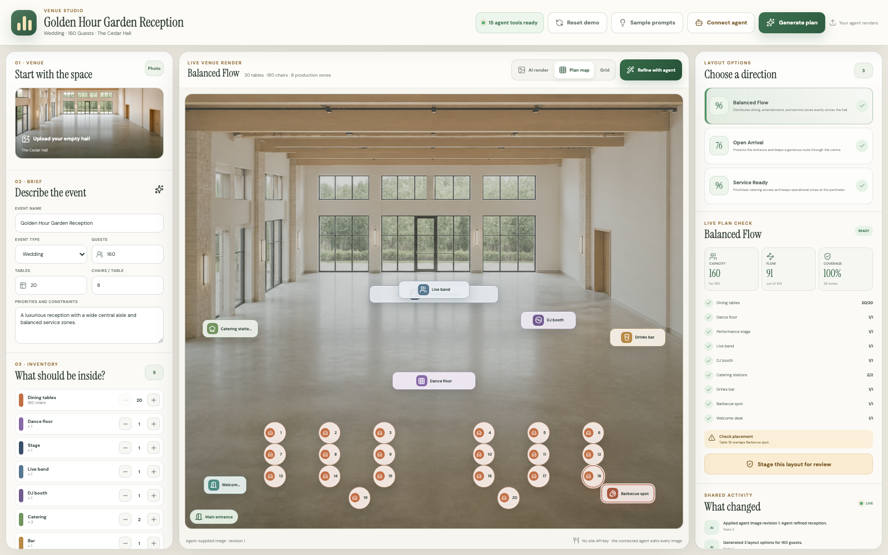

The automated browser journey performs the same meaningful operations as the demo: configures an event through WebMCP, creates 23 exact table objects, rotates the band on three axes, requests an image edit, applies two guarded image revisions, captures the scene for inspection, validates the plan, and stages it without exposing agent approval.

Current verification:

- 13 unit and WebMCP tests passing
- 4 Chromium end-to-end journeys passing
- TypeScript check passing
- ESLint passing
- Production build passing
- Judge screenshots generated by a repeatable Playwright capture

## WebMCP tool surface

| Tool | What the agent can do | Read only |
| --- | --- | --- |
| `venue.read_project` | Read venue, brief, inventory, layouts, element IDs, issues, and workflow state | Yes |
| `venue.capture_scene` | Receive the rendered venue PNG for visual inspection | Yes |
| `venue.load_image` | Load an image supplied by the user or another tool | No |
| `venue.get_edit_request` | Receive the current image, exact edit brief, and state-version token | Yes |
| `venue.apply_image_revision` | Return an agent-generated image without overwriting newer human work | No |
| `venue.configure_event` | Update event type, counts, name, and planning notes | No |
| `venue.set_requirements` | Add or replace count-based inventory | No |
| `venue.generate_layouts` | Generate up to three visible layout strategies | No |
| `venue.add_elements` | Add supported or custom zones | No |
| `venue.transform_elements` | Move, resize, scale, flat-rotate, or orient objects in 3D | No |
| `venue.remove_elements` | Remove objects from the selected plan | No |
| `venue.render_scene` | Return the first-render image and structured edit brief | Yes |
| `venue.refine_scene` | Return the latest image and targeted refinement brief | Yes |
| `venue.validate_layout` | Recheck capacity, coverage, overlap, service, and arrival rules | Yes |
| `venue.stage_layout` | Stage a valid recommendation for human review | No |

There is intentionally no `approve_layout` or agent export tool.

## Run locally

Requirements: Node.js 20 or newer and a Chromium-based WebMCP-capable browser for the agent flow.

```bash
npm install
npm run dev
```

Open the printed local URL. The manual layout editor works in a normal browser. In a WebMCP-capable browser, the 15 tools register automatically while the page is open.

No `.env` file, image-provider credential, or API key is required.

## Verify locally

```bash
npm run typecheck
npm run lint
npm test
npm run build
npm run test:e2e
```

To regenerate the submission screenshots:

```bash
mkdir -p docs/submission/assets
npm run screenshots
```

## Architecture

- React 19 and TypeScript render the shared planning workspace.
- Zustand owns event, inventory, plan, render, review, and activity state.
- A deterministic layout engine produces strategies and revalidates every mutation.
- Zod validates every agent-provided input at runtime.
- `use-webmcp-tool` registers 15 focused tools with explicit read/write annotations.
- The connected agent owns image generation; Venue Studio exchanges image content and edit briefs through WebMCP.
- State-version tokens prevent a late image result from overwriting newer human work.
- Motion and CSS provide progressive render transitions and a responsive professional workspace.
- Vitest verifies the domain and tool contracts; Playwright verifies the real human and agent journeys.

## Submission material

- [Devpost draft](devpost-submission.md)
- [90-second demo script](docs/submission/DEMO_SCRIPT.md)
- [Judge and capture guide](docs/submission/JUDGE_GUIDE.md)
- [Venue image credits](SOURCES.md)
- [Product requirements](PRD.md)
- [Ten-event contact sheet](public/showcase/all-ten-contact-sheet.jpg)

## Honest limitations

This hackathon build is a polished vertical slice, not CAD software. It does not infer exact room dimensions, certify fire-code compliance, book vendors, synchronize multiple users, or persist projects to an account. Photoreal quality depends on the connected agent’s image capability. Layout validation is deterministic and useful for planning, but it is not professional safety certification.

## References

- [WebMCP documentation](https://learn.chatgpt.com/docs/webmcp)
- [The WebMCP Challenge](https://openai.com/webmcp-challenge/)
- [Devpost challenge page](https://webmcp.devpost.com/)

## License

MIT. Third-party venue-photo attributions are listed in [SOURCES.md](SOURCES.md).
